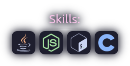

<h1>

</h1>
Hi, I'm <a href="https://mekb-turtle.github.io">mekb</a>. I'm a software developer, I mainly write in C, but sometimes Node.js, C#, Bash, and Java.  
 
<a href="https://github.com/mekb-turtle">
 
 
</a>

<!-- inspired by https://github.com/CallMeEchoCodes' readme -->

